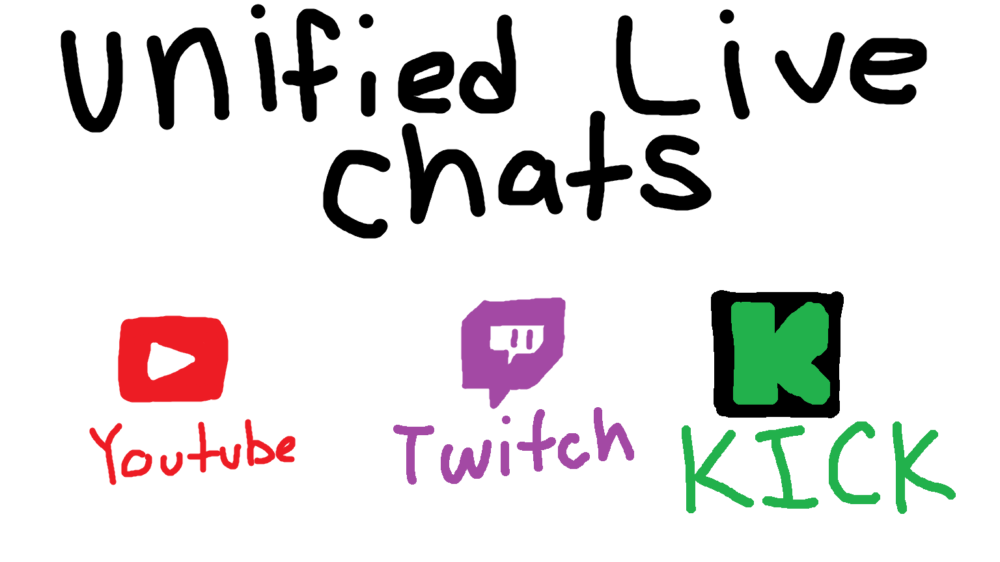
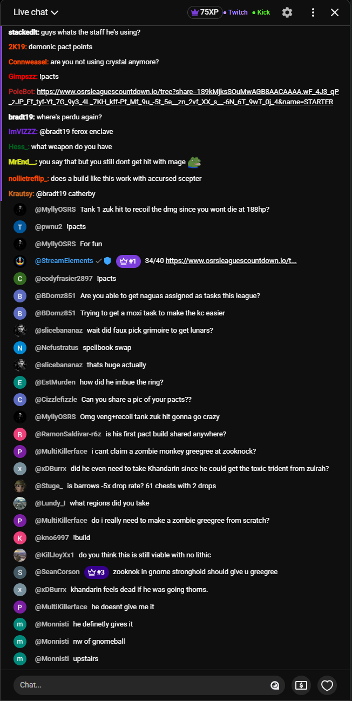
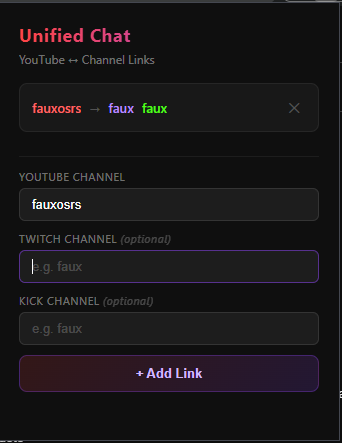

<div align="center">
  
  <h1>Unified Live Chat</h1>
  <p>Seamlessly merge Twitch and Kick live chat feeds directly into the native YouTube Live Chat interface.</p>
</div>

## 100% Vibe Coded

Built with Antigravity using Claude and Gemini pro.
I cannot say that I will update this project much to be honest, just put this together for myself to have the different chats within youtube. 

## 📸 Screenshots





## 🚀 Installation

### Unpacked Extension (Developer/Manual Install)

1. **Clone the repository:**
   ```bash
   git clone https://github.com/your-username/UnifiedLiveChat.git
   ```
2. Open Google Chrome or any Chromium-based browser (Edge, Brave).
3. Navigate to `chrome://extensions/` (or `edge://extensions/`).
4. Enable **Developer mode** in the top right corner.
5. Click **Load unpacked** and select the `extension/` directory from this repository.

## 🛠️ Built With

* Vanilla JavaScript
* HTML5 / CSS3
* Chrome Extension Manifest V3 API

## 📝 License

This project is licensed under the MIT License - see the [LICENSE](LICENSE) file for details.
